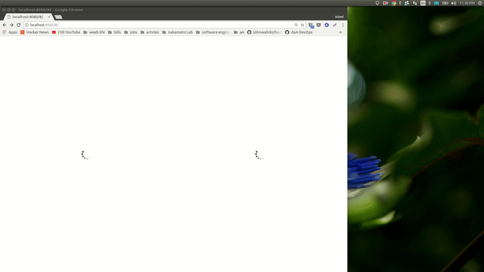

# ClearMetal Challenge
 
 React and Redux were used to create a frontend that allows a user to:

 1) View all of the containers that need to be shipped
 2) View the vessels that are leaving today
 3) Assign containers to a vessel
 4) "Save" a vessel plan by posting to the API
 5) View any vessel plans they've created

### UI



#### *1) View all of the containers that need to be shipped*

The containers slice of state should maintain a record of containers that have not been allocated to a vessel, as such a *removeContainers* is needed to handle the logic for container-vessel mapping submissions:

```javascript
// ---------- containers action utils ----------
export const fetchContainers = () => (
  axios.get(url)
    .then(resp => resp)
);

// ---------- containers actions ----------
export const receiveContainers = containers => ({
  type: RECEIVE_CONTAINERS,
  containers
});

export const removeContainers = containerIds => ({
  type: REMOVE_CONTAINERS,
  containerIds
});

// asynchronous thunk action creator
export const fetchContainers = () => dispatch => (
  ContainerUtils.fetchContainers()
    .then( containers => dispatch(receiveContainers(containers)))
);
```

Lodash merge was used to create a deep copy of the state to handle the *removeContainers* action in the containers reducer:

```javascript
// ---------- containers reducer ----------
const initialState = {};
const containersReducer = (state = initialState, action) => {
  Object.freeze(state);
  switch (action.type) {
    case RECEIVE_CONTAINERS:
      return action.containers.data;
    case REMOVE_CONTAINERS:
      const copyState = merge([], state);
      const newState = [];
      for (let i = 0; i < copyState.length; i++) {
        const curr = copyState[i];
        if (action.containerIds.includes(curr.id)) {
          continue;
        } else {
          newState.push(curr);
        }
      }
      return newState;
    default:
      return state;
  }
};
```

Each container item has an event handler for handleSelect which sets a new local state that contains a map for which vessel a container item belongs to:

```javascript
<table className='containers-table'>
  <tbody>
      {
      this.props.containers.map(
        (container) => {
          return (
            < ContainerItem
            key={container.id}
            id={container.id}
            containerNumber={container.container_number}
            vessels={this.props.vessels}
            handleSelect={ (containerId, vesselId) =>
              this.handleSelect(containerId, vesselId) } />
            );
          }
        )
      }
  </tbody>
</table>
handleSelect(containerId, vesselId) {
  const containersMapObj = this.state.containersMap;
  containersMapObj[containerId] = vesselId;
  this.setState({ containersMap: containersMapObj });
}
```

*handleSubmit* creates an object -- keys correspond to *vesselIds* and values correspond to an array of *containerIds* -- in addition after a plan is submitted, containers that were added to a plan are removed from the redux state and the local state is reset.

```javascript
handleSubmit(e) {
  e.preventDefault();

  const payloads = [];
  const vesselsMap = {};
  const containerIds = Object.keys(this.state.containersMap).map(id => parseInt(id));
  const vesselIds = Object.values(this.state.containersMap).map(id => parseInt(id));
  const uniqVesselIds = new Set();

  vesselIds.forEach( vesselId => {
    uniqVesselIds.add(vesselId);
    vesselsMap[vesselId] = [];
    }
  );

  containerIds.forEach( containerId => {
    const shippingVesselId = this.state.containersMap[containerId];
    vesselsMap[shippingVesselId].push(containerId);
  });

  uniqVesselIds.forEach( vesselId => {
    payloads.push(
      { "vessel_id": vesselId,
        "container_ids": vesselsMap[vesselId] }
    );
  });

  // ----------  4) "Save" a vessel plan by posting to the API ----------
  Promise.all(payloads.map( payload => this.props.createPlan(payload)))
    .then(this.props.removeContainers(containerIds));

  this.setState({
    loading: false,
    containersMap: {}
  });
}
```

#### *2) View the vessels that are leaving today and 3) Assign containers to a vessel*

Each container item has a dropdown selection for the vessels that it may be mapped to via the *onChange* event handler / *handleSelect* callback:

```javascript
<tr className='containers-table-item'>
  <td className='container-item-id'>
    { id }
  </td>
  <td className='container-item-number'>
    { containerNumber }
  </td>
  <td className='container-item-vessels'>
    <select onChange={ e => handleSelect(id, e.target.value) }>
      <option defaultvalue="" hidden>Select vessel</option>
      {
        vessels.map( vessel => {
          return (
            <option
              key={vessel.id}
              value={vessel.id}>
              {
                vessel.name
              }
            </option>
          );
        })
      }
    </select>
  </td>
</tr>
```

#### *4) "Save" a vessel plan by posting to the API*

Plans are fetched on *componentWillMount* and, as discussed above, created on submit via a post request:

```javascript
// ---------- async plans action utils ----------
export const createPlan = (payload) => (
  axios.post(url, payload)
    .then(resp => resp)
);

export const fetchPlans = () => (
  axios.get(url)
    .then(resp => resp)
);
```

```javascript
// ---------- actions ----------
export const receivePlan = vesselPlan => ({
  type: CREATE_PLAN,
  vesselPlan
});

const receivePlans = vesselPlans => ({
  type: FETCH_PLANS,
  vesselPlans
});

// // ---------- async thunk action creators ----------
export const createPlan = (payload) => dispatch => (
  PlansUtils.createPlan(payload)
  .then( vesselPlan => dispatch(receivePlan(vesselPlan)))
);

export const fetchPlans = () => dispatch => (
  PlansUtils.fetchPlans()
  .then( vesselPlans => dispatch(receivePlans(vesselPlans)))
);
```

The front-end slice of state for plans is initialized via the asynchronus *fetchPlans* thunk action creator in the plans component *componentWillMount* lifecycle method -- no additional *GET* requests are made for plans since the reducer below will ensure the plans slice of state reflects the user's changes:

```javascript
const plansReducer = (state = initialState, action) => {
  Object.freeze(state);
  switch (action.type) {
    case FETCH_PLANS:
      return action.vesselPlans.data;
    case CREATE_PLAN:
      const newState = merge([], state);
      const vesselPlan = action.vesselPlan.data;
      const vesselId = vesselPlan.vessel_id;
      const vesselContainers = vesselPlan.container_ids;
      newState.push({
        "vessel_id": vesselId,
        "container_ids": vesselContainers
      });
      return newState;
    default:
      return state;
  }
};
```

#### *5) View any vessel plans they've created*

A plans component fetches all plans on *componentWillMount*; the component is hooked into the redux slice of state for plans which may change when a plan has been submitted (via the containers component) -- a change triggers a re-render of the plans component with the updated slice of state (no additional *GET* requests; this is a design choice that I would reconsider if there were multiple users making post requests to our API):

```javascript
componentWillMount() {
  this.props.fetchPlans()
    .then(() => this.setState({ loading: false }))
}

componentDidUpdate() {
  if (!this.state.loading) {
    this.scrollToBottom();
  }
}

scrollToBottom() {
  this.el.scrollIntoView({ behaviour: 'smooth' });
}
```

*NB:* the plans component uses  a ref to scroll to the bottom of the plans component whenever the componentDidUpdate lifecycle method is triggered

The plans component maps over and renders each plan item that is in the plans slice of state:

```javascript
<table className='plans-table'>
  <tbody>
    {
      this.props.plans.map( (plan, idx) => {
        return (
          < PlanItem 
            key={idx}
            vesselId={plan.vessel_id}
            containers={plan.container_ids} />
          );
        }
      )
    }
    <tr ref={el => { this.el = el; }}></tr>
  </tbody>
</table>
```

### Flask API

```
## API
```api.py``` contains a very simple Flask API

###To run the api:
1) (Optionally) Create a virtualenv <br>
```virtualenv venv```
<br>
 ```source venv/bin/activate```
2) ```pip install -r requirements.txt```
3) ```python api.py```
4) Test it by running: ```curl http://127.0.0.1:8000/containers```


###Endpoints

1) Get a list of containers that need to be shipped
```
GET /containers
```
```
Response:
[
    {"id": 0, "container_number": "MSCU1252187"},
    {"id": 1, "container_number": "CMAU2810425"},
    ...
]
```
2) Get a list of vessels leaving today
```
GET /vessels
```
```
Response:
[
    {"id": 0, "name": "CMA CGM BENJAMIN FRANKLIN"},
    {"id": 1, "name": "CORNELIUS MAERSK"},
    ...
]
```
3) Get a list of vessel plans
```
GET /vessel_plans
```
```
Response:
[
    {
        "vessel_id": 1, 
        "container_ids": [1, 2, 3]
    },
    {
        "vessel_id": 2, 
        "container_ids": [4, 5, 6]
    }
    ...
]
```
4) Post a vessel plan
```
POST /vessel_plans
```
```
Payload Body:
{
    "vessel_id": 1, 
    "container_ids": [1, 2, 3]
}
```
```
Response:
{
    "vessel_id": 1, 
    "container_ids": [1, 2, 3]
}
```
```
Example:
curl -H "Accept: application/json" -X POST  -d '{"vessel_id": 2, "container_ids": [1, 8, 3]}' http://127.0.0.1:8000/vessel_plan
```
